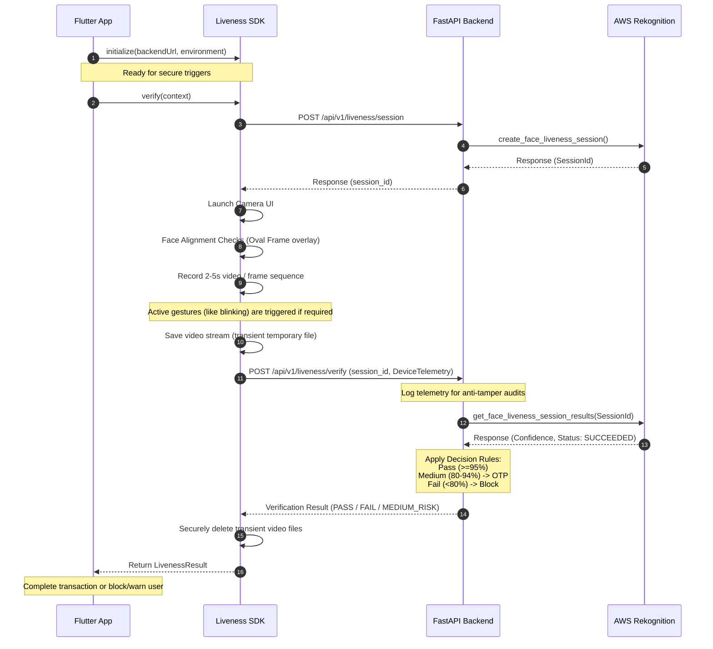

# Architectural Design - Biometric Liveness Verification

This document details the system components, data flows, and architectural decoupling mechanisms implemented in the CST Biometric Liveness solution.

---

## High-Level Component Relationship

```
┌───────────────┐         Method Invocation         ┌──────────────────────┐
│  Flutter App  │ ────────────────────────────────> │ Liveness SDK Package │
└───────────────┘                                   └──────────────────────┘
        │                                                      │
        │                                                      │ Triggers
        │                                                      ▼
        │                                           ┌──────────────────────┐
        │                                           │ Liveness Camera View │
        │                                           └──────────────────────┘
        │                                                      │
        │ HTTP API Calls (Session / Verify)                    │ Streams video/frames
        └───────────────────────┬──────────────────────────────┘
                                │
                                ▼
                    ┌──────────────────────┐
                    │ FastAPI Backend API  │
                    └──────────────────────┘
                                │
                                │ Boto3 Rekognition client calls
                                ▼
                    ┌──────────────────────┐
                    │ AWS Rekognition Service
                    └──────────────────────┘
```

---

## Detailed Sequence Flow

The following sequence diagram represents the step-by-step process of creating a session, running the interactive guided camera scan, uploading frame telemetry, and verifying the liveness check against the fraud decision matrix.



---

## Decoupled Provider Abstraction Model

To avoid vendor lock-in with AWS Rekognition, the SDK isolates engine-specific logic behind a clean contract interface:

```dart
abstract class LivenessProvider {
  Future<void> initialize(LivenessConfig config);
  Future<LivenessResult> verify(BuildContext context);
  bool get isInitialized;
}
```

The consumer application interacts only with the top-level `LivenessSDK` static interface. This design allows swapping the underlying implementation class from `AwsRekognitionLivenessProvider` to another vendor (e.g., `FaceTecLivenessProvider`, `iProovLivenessProvider`, or `JumioLivenessProvider`) through config updates without changing any code in downstream mobile applications.
